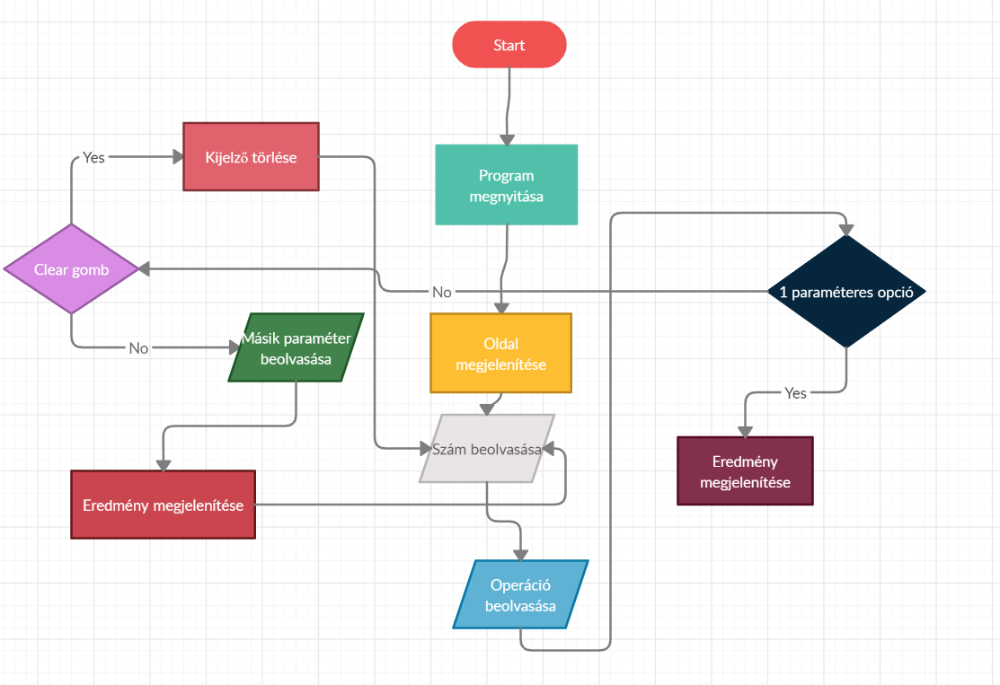

Rendszerterv
============

## Rendszer használati esetei, lefutásaik ábra

## Tervek

#### Ütemterv:
Projekt kezdete: 2020.09.07.

Követelményspecifikáció határideje: 2020.09.19.

Funkcionális specifikáció határideje: 2020.09.25.

Rendszerterv határideje: 2020.09.25.

Projekt elkészítésének határideje: 2020.09.28.

#### A projekt résztvevői:
A projekten 3 db programtervező informatikus hallgató dolgozik.

Tóth János Donát (fejlesztő)

Pataki Donát (fejlesztő)

Turi Marcell Gergő (fejlesztő)

## Wireframe

## Rendszer célja

A rendszer célja, hogy egy egységes felületet biztosítson a cég emberei számára a számítások elvégzéséhez.

A legfőbb cél, hogy az alkalmazás különböző fajta eszközökön is működjön, reszponzív design alkalmazásával.

Web eszközök használata szükséges: HTML, CSS.

A szám-, illetve operációgombok megjelenésükben különüljenek el.

A  Clear gombot is implentálunk kell, mely törli az eddigi karaktereket. 

A felhasználói felület, illetve a megjelenés legyen testreszabható, ezzel hatékonyabbá téve az egyes részlegeken dolgozók munkáját.
 
Fontos elvárás, hogy a matematikai alap müveleteket maradéktalanul elvégeze, mert ez  fontos a megrendelő számára.

A felületnek egyszerünek és kezelhetőnek kell lennie, hogy mindenki könyön kitudja számoni azt amit szeretne. 

A rendszernek célja, hogy teljes mértékben helyettesítsen egy tudományos számológépet és többet is tudjon mint egy rendes számológép. 

## Miből (erőforrások)
